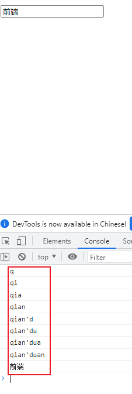
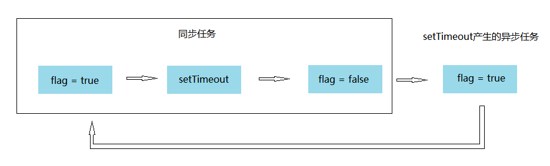

# 1. 数据类型

js数据类型包括原始类型和引用类型

① **原始类型（值类型、基本类型）**：字符串（String）、数字(Number)、布尔(Boolean)、空（Null）、未定义（Undefined）、Symbol。

② **引用数据类型（对象类型）**：对象(Object)、数组(Array)、函数(Function)，还有两个特殊的对象：正则（RegExp）和日期（Date）。

# 2. 箭头函数

箭头函数与普通函数的区别：

> 书写方式不同：
>
> ① 只有一形参时可以省略括号
>
> ② 只有简单的返回时可以去掉花括号和return关键字
>
> this指向不同：
>
> ① **普通函数，谁调用这个函数，this就指向谁**
>
> ② **箭头函数，在哪里定义函数，this指向谁（可以说指向父级作用域）**

注：像这种匿名函数`function(){}`，它的调用者是顶部对象window（在node环境是node）

## 1.1 书写方式不同

```js
//1.
const Fn = function () {
    return 'function'
}
//等价于
const Fn = () => 'function'

//2.
const Fn = function (a) {
    return a
}
//等价于
const Fn = (a) => a

//3.
const Fn = function (a, b) {
    return { a, b }
}
//等价于
const Fn = (a, b) => { a, b }
```

## 1.2 this指向不同

~~~js
let obj = {
    name: '小明',
    sayName(){
        // 调用内部匿名函数的时顶部对象widow，它没有name
        setTimeout(function(){
            console.log(this.name);
        },500)
    }
}
obj.sayName() //undefined
~~~

~~~js
let obj = {
    name: '小明',
    sayName(){
        // this 指向父级上下文
        setTimeout(() => {
            console.log(this.name);
        },500)
    }
}
obj.sayName() //小明
~~~

# 3. 闭包

① 基本概念：函数嵌套函数，内部函数就是闭包

② 特性：正常情况下，函数执行完成之后，内部变量会被销毁（JS垃圾回收机制：释放内存空间）；**而在闭包中内部函数没有执行完成前，外部函数函数的变量不会被销毁。**

~~~js
function outerFun() {
    const a = 1
    console.log(a);
}

//执行完了，所以内部变量a销毁了
outerFun()
~~~

~~~js
function outerFun() {
    const a = 1
    function innerFun() {
        console.log(a);
    }
    return innerFun
}

//外部函数执行完了，但是内部函数没执行完，所以内部变量a还未销毁
const fun = outerFun()
~~~

③ 应用：封装功能代码，实现模块化

~~~js
//fun模块内部有2个方法
const fun = (function(){
    //私有变量
    let a = 1
    let b = 2
    function increment() {
        return a + b
    }
    function decrement() {
        return b - a
    }

    return {increment, decrement}
})()

const result1 = fun.increment()
const result2 = fun.decrement()

console.log(result1, result2)

~~~

# 4. 防抖节流

## 4.1 防抖

基本概念：用户对一个事件频繁的触发，我们只需要最后一次对事件的操作。

应用：一个搜索框，当用户输入值时发起请求获取数据

~~~html
<body>
  <input type="text">

  <script>
    const inp = document.querySelector('input')
    inp.oninput = function() {
      console.log(this.value);
    }
  </script>
    
</body>
~~~



由此可见，输入框每输入一个值时都会发起一个请求来获取数据，整个过程发起了9次请求，而我们只需要最后一个输入的结果。所以我们可以通过不断重置定时器的方式来确定本次操作是否是最后的一次操作。

~~~html
<body>
  <input type="text">

  <script>
    const inp = document.querySelector('input')
    let timer = null
    inp.oninput = function() {
      //如果定时器存在，则清除定时器，重新定时
      if(timer) {
        clearTimeout(timer)
      }
      timer = setTimeout(()=> {
        console.log(this.value);
      },500)
    }
  </script>
</body>
~~~

通过闭包封装成一个独立的方法

~~~js
// 第一个参数是需要进行防抖处理的函数，第二个参数是延迟时间，默认为1秒钟
function debounce(fn, delay = 1000) {
// 实现防抖函数的核心是使用setTimeout
    // time变量用于保存setTimeout返回的Id
    
    let time = null
    
    function _debounce() {
        // 如果time不为0，也就是说有定时器存在，将该定时器清除
        if (time !== null) {
            clearTimeout(time)
        }
        
        time = setTimeout(() => {
            fn()
        }, delay)
    }
    
    // 防抖函数会返回另一个函数，该函数才是真正被调用的函数
    return _debounce
}
~~~

防抖函数的实现-this和参数问题

~~~html
<body>
  <input type="text">

  <script>
    debounce(callbackFun, delay = 1000) {
      let timer = null
      function _debounce(...args) {
        //① 此处的调用者是input，所以此处的this指向的是input
        if (timer) {
          clearTimeout(timer)
        }
        timer = setTimeout(() => {
          //② 这里用了箭头函数，所以这里的this还是input
          //使用apply改变callbackFun的this，同时将参数传递给fn
          callbackFun.apply(this, args)
        }, delay)
      }

      return _debounce
    }
    
    const inp = document.querySelector('input')
    
    inp.oninput = debounce(function(){
      //③ 此处是一个匿名函数，其调用者是window，
      //所以需要在调用处通过call()绑定正确的this指向:②
      console.log(this.value);
    }, 500)
    
  </script>
</body>
~~~

## 4.2 节流

基本概念：用户对一个事件频繁的触发，我们在限定的时间内获取才正在触发一次（大量 > 小量）。

应用：对于多次输入请求，只1秒内触发一次

~~~html
<body>
  <input type="text">

  <script>
    const inp = document.querySelector('input')
    let flag = true
    inp.oninput =function() {
      if(flag) {
        setTimeout(()=> {
          console.log(this.value);
          flag = true
        }, 500)
      }
      flag = false
    }
  </script>
</body>
~~~



封装函数：

~~~js
<body>
  <input type="text">

  <script>
    function throttle(fn, delay) {
      let flag = true
      function _throttle(...args) {
        if(flag) {
          setTimeout(()=> {
            fn.apply(this, args)
            flag = true
          }, delay)
        }
        flag = false
      };
      
      return _throttle
    }

    const inp = document.querySelector('input')
    inp.oninput = throttle(function() {
      console.log(this.value);
    }(),500)
    
  </script>
</body>
~~~

对比时间实现

~~~js
/**
 * 节流函数 一个函数执行一次后，只有大于设定的执行周期才会执行第二次。有个需要频繁触发的函数，出于优化性能的角度，在规定时间内，只让函数触发的第一次生效，后面的不生效。
 * @param fn要被节流的函数
 * @param delay规定的时间
 */
function throttle(fn, delay) {
    //记录上一次函数触发的时间
    let lastTime = 0;
    return function(){
        //记录当前函数触发的时间
        let nowTime = Date.now();
        if(nowTime - lastTime > delay){
            //修正this指向问题
            fn.call(this);
            //同步执行结束时间
            lastTime = nowTime;
        }
    }
}

document.onscroll = throttle(function () {
    console.log('scllor事件被触发了' + Date.now());
}, 200); 
~~~


this的指向

[(26条消息) 五种绑定彻底弄懂this，默认绑定、隐式绑定、显式绑定、new绑定、箭头函数绑定详解_隐式绑定和显示绑定的含义_行星飞行的博客-CSDN博客](https://blog.csdn.net/echolunzi/article/details/126057941?spm=1001.2014.3001.5501)


new关键词发生了什么

准确来说，js 中的构造函数只是使用new 调用的普通函数，它并不是一个类，最终返回的对象也不是一个实例，只是为了便于理解习惯这么说罢了。

那么new一个函数究竟发生了什么呢，大致分为三步：

① 以构造器的prototype属性为原型，创建新对象；
② 将this(可以理解为上句创建的新对象)和调用参数传给构造器，执行；
③ 如果构造器没有手动返回对象，则返回第一步创建的对象
这个过程我们称之为构造调用，我们来看个例子：

~~~js
function Fn(){
    this.name = '听风是风';
};
let echo = new Fn();
echo.name//听风是风
~~~

在上方代码中，构造调用创建了一个新对象echo，而在函数体内，this将指向新对象echo上（可以抽象理解为新对象就是this）。
